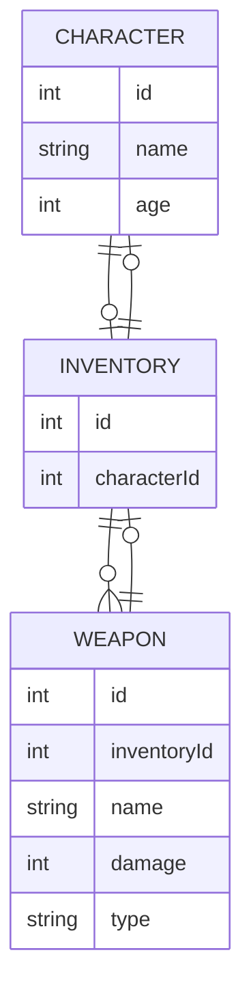

# Sequelize Sandbox

This repo is an example of using Sequelize, TypeScript, and Express. Each directory has its own README.md file to serve as documentation. 

The goal here is to provide simple examples for using Sequelize, as well as establishing useful patterns to follow in similar projects.

Following the setup will give you a running Express API with a persistent PostgreSQL database via Docker. From there, you can experiment with creating new models, controller methods, routes, etc. 

Feel free to fork this repo as a starting point for a project of your own.

## Project Navigation
- [**src**](./src)
- [**Types**](./src/@types)
- [**Controllers**](./src/controllers)
- [**Models**](./src/models)
- [**Routes**](./src/routes)

## Set up

1. Clone this repo
    ```bash
    git clone git@github.com:nealwp/sequelize-sandbox.git
    ```

1. Run install
    ```bash
    npm i
    ```

1. Start the local db (requires Docker)
    ```bash
    npm run db:start    # data will persist in Docker volume 'sequelize-pgdata'
    ```

1. Run the dev server
    ```bash
    npm run dev
    ```

1. When you're finished/want to stop the database, run
    ```bash
    npm run db:stop
    ```

- You can import the Postman collection to view and use available endpoints.
- You can also connect to the database on `localhost:5432` via psql or pgAdmin, using the following credentials:
    - User: `postgres`
    - Password: `postgres`
    - Database Name: `scratch`

## Data Model

The example code in this project is meant to represent a basic inventory system for a game. There are three models to depict this:
1. Characters
1. Inventory
1. Weapons


- A character can be assigned zero or exactly one inventory
- An inventory can be assigned to zero or exactly one character
- A weapon can belong to zero or exactly one inventory
- An inventory can have zero to any number of weapons
- Each entity can exist independently of all other entities

The model is deliberately simple, as the goal here is to give concrete examples of "how to do X with Sequelize & TypeScript" in as little code as possible.

## Disclaimer

The documentation in this repo is opinionated; you will see things like *never do X*, *always do Y*, and *there should be Z*.  I'm well aware that this is not the only way - or even the best way - to logically structure a Sequelize/Express project. However, **it is a way that works**, and works well enough to justify being opinionated about it.

These opinions may be interpreted as rules. If it proves useful for you to follow them - do so. Should you find yourself in a situation where breaking these "rules" makes more sense than following them - great! Do that instead. 

I am confident in your ability to use your noggin.